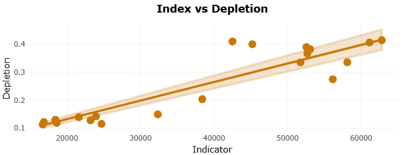
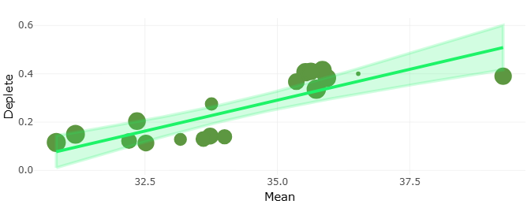
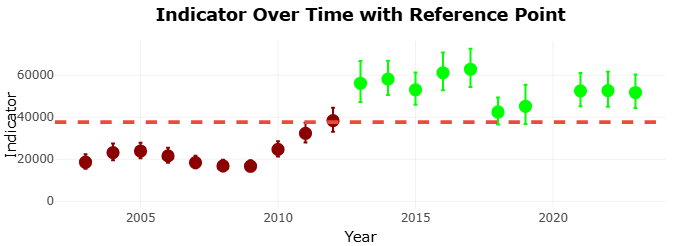
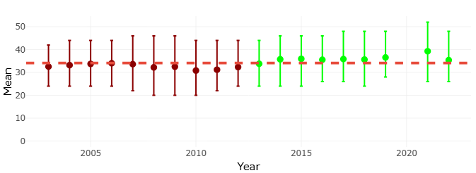
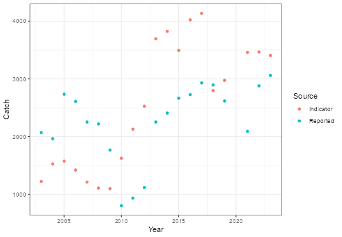

The Groundfish Fishery Management Plan of the Pacific Fishery Management Council currently contains 49 stocks ([**Table 1**](https://docs.google.com/spreadsheets/d/1iRTbv1mJISXalaXOiABToaeBsOpzcPzf22t6ocjt2Pg/edit?pli=1&gid=1140062594#gid=1140062594){style="color: blue"}), each of which are required to have overfishing (OFLs) and annual catch (ACLs) limits specified in order to avoid overfishing. Additionally, stock status designation to determine whether the stock is overfished is also desired. These metrics are used for both management and reporting purposes to fulfill our mandates to the Magnuson-Stevens Fishery Conservation and Management Act.

The ability to meet these requirements varies for the many stocks, as both data (in the form of type, quantity and quality) and resource (e.g., number of analysts, process/time requirements) limitations restrict what can be done and reported for each stock. One way to deal with these restrictions is to develop a system of indicators that help inform catch limits and indicate stock status.

The proposal lays out a framework to use both model and model-free indicators to meet the challenge of informing catch limits and stock status despite data and resource limitations. It uses the idea of the stock assessment continuum (i.e., assessment approaches are a continuum of methods depending on available data) to move among analytical methods to confront data limitations, and leverages stock prioritization to apply simpler indicators to update catch limits and give general stock status in cases where benchmarked model-based estimates are not available because of resource limitations.

::: {#id .class1 key="value"}
\vspace{2em}
:::

### **Developing assessment buckets**

The idea of assessment buckets is meant to coordinate the reasons why certain methods are applied to which stock. It is not inconsistent with the stock categories, but instead extends out the stock categories to include model free indicators.

::: {.class1 key="value"}
\vspace{2em}
:::

#### **Identifying the potential for simple indicator approaches**

The first step was to group species into three initial groups:

-   Group 1: Stocks that have never had a model-based stock assessment that produced stock status. These would include all stocks with catch limits set by catch-only methods and are currently category 3 stocks.

-   Group 2: Stocks with old and/or irregular stock assessments. These are category 1 or 2 stock assessments.

-   Group 3: Stocks with regular/recent stock assessments. These are also category 1 or 2 stock assessments.

The next step is to recognize which stocks would qualify for using simpler indicator approaches to maintain catch limits and as checks on stock status rather than using resources intensive model-based stock assessment methods. This was based on the following criteria:

-   Does the stock have a benchmark stock assessment that shows them at a high stock status?

-   Since the last stock assessment (and particularly in the last 5 years), is the attainment \<50% of the ACL?

-   If a decision table is available, is the catch below the OFL of the lowest state of nature?

If the signal from the first three criteria is not clear, these second stage indicators can be used:

-   Is it above the reference level when using an **abundance-based indicator** (e.g., survey; CPUE)?

-   Is the current **mean length** above the reference point mean length?

-   Is the stock status above the reference level when using **catch and length models**?

-   Using **other indicators**, is the indicator value at a level that shows good health relative to a reference point?

The second stage indicators could be used in a management procedure approach to set catch limits and monitor stock status without needing a benchmark stock assessment, but establishing a reference limit (and subsequent control rule) is a critical step. A shiny app has been developed to investigate possible indicators for any stock and is available [**here**](https://connect.fisheries.noaa.gov/SS3IndicatorMethods/), with the GitHub repository available [**here**](https://github.com/shcaba/SS3_Indicator_methods).

The app has been applied to all stocks that have had at least one stock assessment and are under consideration for indicator methods; results are available in [**Table 2**](https://docs.google.com/spreadsheets/d/1iRTbv1mJISXalaXOiABToaeBsOpzcPzf22t6ocjt2Pg/edit?pli=1&gid=114891814#gid=114891814). The most recent stock assessments were used to develop a simple linear relationship between stock status (the management metric we care most about the indicator tracking) and any proposed indicator (e.g., survey index, CPUE, mean lengths), or rule out indicators because they do not track stock status. Building this relationship allows the user to find the value of the indicator that corresponds to the stock status reference point (e.g., target or limit) that can be used to interpret the indicator. Using the target or limit should be decided upon, as it will dictate what the interpretation of the indicator means and how a control rule could be designed. The app does allow for pre-specified or custom control rules to be applied to demonstrate how the control rule would have performed over the given data based on the reference point and the indicator for that year.

Between the stage 1 and stage 2 indicators, most groundfish stocks have a demonstrable way forward using indicators or simple model-based methods. Indicators can be updated with either new assessments and/or newer indicator data. This could be a rapid way (i.e., just using a few simple indicators) to update catches and observe general stock status. If the status falls below the reference level, this could be used to trigger a benchmark stock assessment.

An example of how the simple indicator approach is provided in the Appendix.

::: {.class1 key="value"}
\vspace{2em}
:::

### Proposed Assessment Buckets with Stocks

Having established the above protocol, the current recommended assessment buckets, or groupings of stocks into different approaches, are suggested:

#### Assessment Bucket #1: Category 3 stocks

Assessment Bucket #1 consists of stocks that do not have any stock assessments and are currently those considered category 3 stocks. It is recommended that these be upgraded from catch–only methods to catch and length models that do not attempt to establish a formal stock status, but can estimate stock status in order to trigger further data collection or stock assessment attention if needed, using our current stock status reference points for groundfishes. Moving these stocks up into assessment bucket #2 would require a full stock assessment. The current recommended list of assessment bucket #1 stocks are listed in [**Table 1**](https://docs.google.com/spreadsheets/d/1iRTbv1mJISXalaXOiABToaeBsOpzcPzf22t6ocjt2Pg/edit?pli=1&gid=1140062594#gid=1140062594){style="color: blue"}.

#### Assessment Bucket #2: Indicator-based stocks

The stocks are ones with at least one stock assessments, but not prioritized for benchmark stock assessments. They have been evaluated for simple indicators and those have been identified and interpreted. If any show indicator responses below reference points, this would trigger data collection and fuller stock assessment consideration. Simple model-based methods (e.g., catch and length; catch updates) could also be included as model-based indicator methods in this assessment bucket. The current recommended list of these stock are listed in [**Table 1**](https://docs.google.com/spreadsheets/d/1iRTbv1mJISXalaXOiABToaeBsOpzcPzf22t6ocjt2Pg/edit?pli=1&gid=1140062594#gid=1140062594){style="color: blue"} and the evaluation of proposed indicators are found in [**Table 2**](https://docs.google.com/spreadsheets/d/1iRTbv1mJISXalaXOiABToaeBsOpzcPzf22t6ocjt2Pg/edit?pli=1&gid=114891814#gid=114891814){style="color: blue"}.

#### Assessment Bucket #3: Routinely assessed stocks

These stocks are highly prioritized for routine stock assessments. These could also be put in assessment bucket #2 to extend the need for full stock assessment treatment. The current list of assessment bucket #3 stocks is found in [**Table 1**](https://docs.google.com/spreadsheets/d/1iRTbv1mJISXalaXOiABToaeBsOpzcPzf22t6ocjt2Pg/edit?pli=1&gid=1140062594#gid=1140062594){style="color: blue"}

### Further considerations

The stock assignments to assessment buckets are not static. They are meant to eventually move bucket #1 stocks to #2; bucket #3 stocks may go into bucket #2 to accommodate advancing stocks from bucket #2 to #3. The whole framework therefore is fluid to accommodate the right sized analysis given resource limitations. When in bucket #3, the various category 1 and 2 stock assessment grading normally performed to determine scientific uncertainty in catch limit calculations continue to apply.

There remain many considerations in order to follow through with this framework. Here are some that are the most prominent:

-   Agreeing on this general framework (multi-indicator frameworks are used commonly around the world and have been for many years) as sufficient and flexible enough to meet the needs of all FMP groundfish stocks.

-   Agreeing on the stage 1 and stage 2 indicators and how to interpret them (i..e, defining reference points). Are these sequential or simultaneous multiple indicators?

-   Agreeing on the control rules to apply to get catch limits (see the Catch Estimation columns in [**Table 2**](https://docs.google.com/spreadsheets/d/1iRTbv1mJISXalaXOiABToaeBsOpzcPzf22t6ocjt2Pg/edit?pli=1&gid=114891814#gid=114891814){style="color: blue"}).

-   Agreeing on how long a stock can reside within bucket #2 and not become stale. If it is meeting the requirements of the multiple indicators and associated reference points, it would seem reasonable that a stock could sit indefinitely in bucket #2.

-   How to continue data collection beyond the bucket #3 stocks so if a bucket #1 or #2 stock are upgraded for consideration, data would be available.

::: {.class1 key="value"}
\vspace{2em}
:::

### [Referenced Tables]{.underline}

[**Table 1**](https://docs.google.com/spreadsheets/d/1iRTbv1mJISXalaXOiABToaeBsOpzcPzf22t6ocjt2Pg/edit?pli=1&gid=1140062594#gid=1140062594). List of stocks in the PFMC Groundfish FMP with their area designation, current stock assessment category, year of last stock assessment, and newly proposed assessment bucket.

[**Table 2**](https://docs.google.com/spreadsheets/d/1iRTbv1mJISXalaXOiABToaeBsOpzcPzf22t6ocjt2Pg/edit?pli=1&gid=114891814#gid=114891814){style="color: blue"}. Potential stage 1 and stage 2 indicators for stocks considered in assessment bucket #2. Color and concern interpretations are found at the bottom of the table.

::: {.class1 key="value"}
\vspace{2em}
:::

### Appendix. Example of setting reference points for indicator approaches: Petrale sole

The 2023 Petrale sole (*Eopsetta jordani*) stock assessment was used as an example of how reference points can be developed for two types of indicators: 1) survey-based and 2) mean length

West Coast Groundfish Bottom Trawl Survey (WCGBTS) index and mean length values were extracted from the stock assessment and compared to the stock status derived from the stock assessment. A linear model (Figure A1 for the survey; Figure A2 for the mean length) was fit to this relationship, then used to predict the survey index or mean length that corresponds to the target stocks status. For flatfishes, this is 0.25B~0~. The time series of either the survey (Figure A3) or mean length (Figure A4) can then be compared to the corresponding indicator reference point corresponding to 0.25B~0~. One can retrospectively see whether the indicators would have predicted the stock status above or below the the target reference point (color of dots in Figures A3 and A4).

One additional analysis is comparing what the recommended catches from a simple management procedure (Previous year's catch \*\[Indicator value/reference point value\]) would recommend (Figure A5) to see how responsive a simple indicator approach can be to setting catch limits to avoid overfishing.

**Figure A1**. Indicator (WCGBTS survey index) versus the corresponding derived stock status (depletion) from the 2023 Petrale Sole stock assessment. Line is the linear model fit used to predict the survey value at 0.25 depletion value (the target reference point).

**Figure A2**. Mean length of fish caught in the WCGBTS to stock status (depletion) from the 2023 Petrale Sole stock assessment. Line is the linear model fit used to predict the mena length value at 0.25 depletion value (the target reference point). Size of the point refers to the effective sample size used in the model.

**Figure A3**. Plot of the WCGBTS survey index by year. Red line is the reference point based on the indicator value at 0.25 depletion from the linear model. Red points indicate if the assessment-based stock status was below the target (0.25) value; green points indicate if the assessment-based stock status was above the target (0.25) value.

**Figure A4**. Plot of the WCGBTS meant length by year. Red line is the reference point based on the indicator value at 0.25 depletion from the linear model. Red points indicate if the assessment-based stock status was below the target (0.25) value; green points indicate if the assessment-based stock status was above the target (0.25) value.

**Figure A5**. Reported (realized) catches and the recommended catch (Indicator) by a simple indicator management procedure (Indicator/Reference Point) by year to demonstrate the ability of the simple indicator management procedure to react to population stock status.